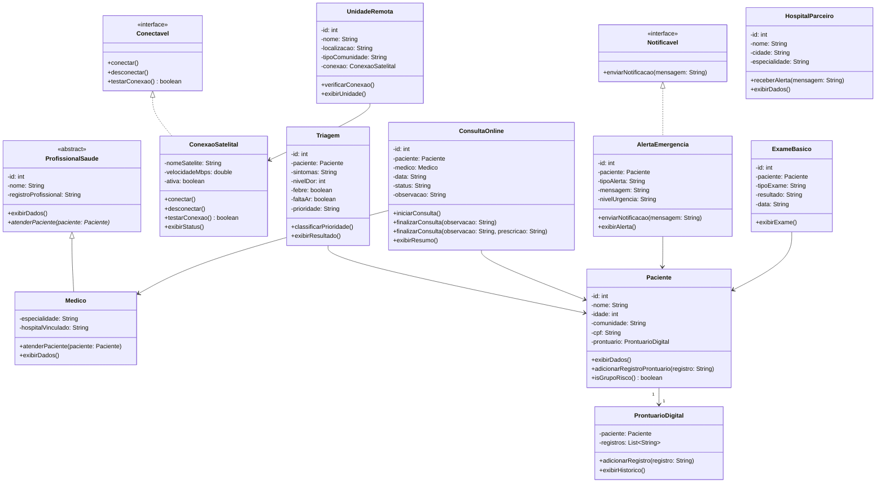

# SpaceMed

SpaceMed é uma aplicação Java que simula uma plataforma de telemedicina via satélite para regiões isoladas, permitindo cadastro de pacientes, médicos, unidades remotas, triagem, consultas online, prontuário digital e alertas de emergência.

---

## 1. Objetivo do Projeto

Demonstrar domínio de Programação Orientada a Objetos em Java puro, modelando um sistema de telemedicina via satélite voltado para comunidades isoladas — como aldeias indígenas, comunidades ribeirinhas e zonas rurais sem acesso à internet estável.

---

## 2. Problema Escolhido

Regiões remotas do Brasil (e do mundo) sofrem com a ausência de infraestrutura de saúde. Comunidades indígenas, ribeirinhas e rurais muitas vezes ficam sem atendimento médico por semanas ou meses devido à distância de centros urbanos e à falta de conectividade. A SpaceMed propõe uma solução de telemedicina utilizando conectividade via satélite para viabilizar consultas remotas, triagem inteligente, prontuário digital e alertas de emergência.

---

## 3. Relação com o ODS 9

O **ODS 9 — Indústria, Inovação e Infraestrutura** promove a construção de infraestruturas resilientes e o incentivo à inovação. A SpaceMed se alinha diretamente a essa meta ao:

- Propor infraestrutura de conectividade via satélite para regiões sem internet;
- Inovar no modelo de atendimento médico remoto;
- Reduzir desigualdades no acesso à saúde por meio de tecnologia;
- Conectar unidades remotas a hospitais parceiros em centros urbanos.

---

## 4. Funcionalidades

- Cadastro de pacientes com prontuário digital automático
- Cadastro de médicos parceiros com especialidade e hospital vinculado
- Cadastro de unidades remotas com conexão via satélite simulada
- Triagem inteligente com classificação de prioridade (BAIXA, MÉDIA, ALTA, EMERGÊNCIA)
- Geração de alertas de emergência com notificação automática aos hospitais parceiros
- Registro de consultas online com observação e/ou prescrição médica
- Exibição de prontuário digital do paciente
- Relatório geral do sistema

---

## 5. Conceitos de Java Utilizados

| Conceito | Onde foi utilizado |
|---|---|
| **Classe Abstrata** | `ProfissionalSaude` com método abstrato `atenderPaciente()` |
| **Herança** | `Medico extends ProfissionalSaude` |
| **Interfaces** | `Conectavel` (implementada por `ConexaoSatelital`) e `Notificavel` (implementada por `AlertaEmergencia`) |
| **Sobrescrita (@Override)** | `Medico.atenderPaciente()`, `Medico.exibirDados()`, métodos de `ConexaoSatelital` e `AlertaEmergencia` |
| **Sobrecarga** | `ConsultaOnline.finalizarConsulta(String)` e `finalizarConsulta(String, String)` |
| **Encapsulamento** | Todos os atributos são `private` com getters/setters |
| **Coleções (ArrayList)** | `SpaceMedService` armazena todas as entidades em listas |
| **Scanner** | Menu interativo no console em `Main.java` |
| **Classes Utilitárias** | `Validador` com métodos estáticos de validação |

---

## 6. Estrutura de Pacotes

```
SpaceMed/
└── src/
    ├── app/
    │   └── Main.java
    ├── model/
    │   ├── Paciente.java
    │   ├── Medico.java
    │   ├── UnidadeRemota.java
    │   ├── HospitalParceiro.java
    │   ├── ConsultaOnline.java
    │   ├── Triagem.java
    │   ├── ProntuarioDigital.java
    │   ├── ExameBasico.java
    │   ├── AlertaEmergencia.java
    │   └── ConexaoSatelital.java
    ├── abstracts/
    │   └── ProfissionalSaude.java
    ├── interfaces/
    │   ├── Conectavel.java
    │   └── Notificavel.java
    ├── service/
    │   ├── SpaceMedService.java
    │   └── TriagemService.java
    └── util/
        └── Validador.java
```

---

## 7. Como Executar

### Pré-requisitos

- Java JDK 11 ou superior instalado
- Terminal (cmd, PowerShell, bash)

### Compilação

```bash
# A partir da raiz do projeto (pasta SpaceMed)
javac -d out -sourcepath src src/app/Main.java
```

### Execução

```bash
java -cp out app.Main
```

---

## 8. Diagrama de Classes (Mermaid)



---

## 9. Respostas Discursivas

### 1. Onde a herança foi utilizada no projeto e por que ela faz sentido nesse contexto?

A herança foi utilizada na relação entre `ProfissionalSaude` (classe abstrata) e `Medico`. `ProfissionalSaude` centraliza atributos e comportamentos comuns a qualquer profissional de saúde — como `id`, `nome` e `registroProfissional` — além de definir o contrato abstrato `atenderPaciente()`. A classe `Medico` herda esses elementos e os especializa, adicionando `especialidade` e `hospitalVinculado`, e implementando o atendimento ao paciente de forma concreta. Essa estrutura faz sentido porque reflete a realidade: um médico é um tipo específico de profissional de saúde, e a herança elimina duplicação de código ao mesmo tempo em que força a implementação do comportamento essencial.

### 2. Qual foi a diferença entre a interface e a classe abstrata utilizadas no projeto?

A classe abstrata `ProfissionalSaude` representa uma **entidade concreta com estado** — ela possui atributos (dados) e pode ter métodos concretos, servindo como base para herança de uma hierarquia de tipos relacionados. Já as interfaces `Conectavel` e `Notificavel` definem **contratos de comportamento** sem estado próprio: qualquer classe que precise "conectar via satélite" ou "enviar notificações" pode implementar essas interfaces, independente de sua hierarquia. A diferença principal é que a classe abstrata modela um "é um" (Medico é um ProfissionalSaude), enquanto a interface modela um "pode fazer" (ConexaoSatelital pode conectar).

### 3. Onde ocorreu sobrescrita de métodos no sistema?

A sobrescrita (`@Override`) ocorreu em:
- `Medico.atenderPaciente(Paciente)`: sobrescreve o método abstrato de `ProfissionalSaude`, adicionando lógica de exibição do atendimento e verificação de grupo de risco;
- `Medico.exibirDados()`: sobrescreve o método concreto de `ProfissionalSaude`, chamando `super.exibirDados()` e adicionando as informações específicas do médico;
- `ConexaoSatelital.conectar()`, `desconectar()` e `testarConexao()`: implementam os métodos da interface `Conectavel`;
- `AlertaEmergencia.enviarNotificacao(String)`: implementa o método da interface `Notificavel`.

### 4. Onde ocorreu sobrecarga de métodos no sistema?

A sobrecarga ocorreu na classe `ConsultaOnline`, com dois métodos `finalizarConsulta`:
- `finalizarConsulta(String observacao)`: finaliza a consulta registrando apenas a observação no prontuário;
- `finalizarConsulta(String observacao, String prescricao)`: finaliza a consulta registrando tanto a observação quanto a prescrição médica no prontuário.

Ambos os métodos têm o mesmo nome mas assinaturas diferentes (número de parâmetros), caracterizando sobrecarga.

### 5. Como esse projeto poderia evoluir futuramente para uma aplicação maior?

O projeto tem bases sólidas para escalar. Possíveis evoluções incluem:
- **Persistência de dados**: integração com banco de dados relacional (via JDBC) ou arquivo JSON/XML para salvar e recuperar registros entre sessões;
- **API REST**: exposição dos serviços via Spring Boot para integração com aplicativos móveis usados em campo;
- **Autenticação e perfis**: controle de acesso diferenciado para médicos, enfermeiros e administradores;
- **Módulo de exames**: fluxo completo para registro e consulta de `ExameBasico` com opção no menu;
- **Integração com IoT**: recebimento de dados de dispositivos médicos simples (oxímetros, termômetros) via satélite;
- **Notificações em tempo real**: integração com serviços de SMS ou push notification para alertas de emergência;
- **Relatórios avançados**: análise estatística de triagens, doenças mais frequentes por comunidade e efetividade do atendimento.

#RM 